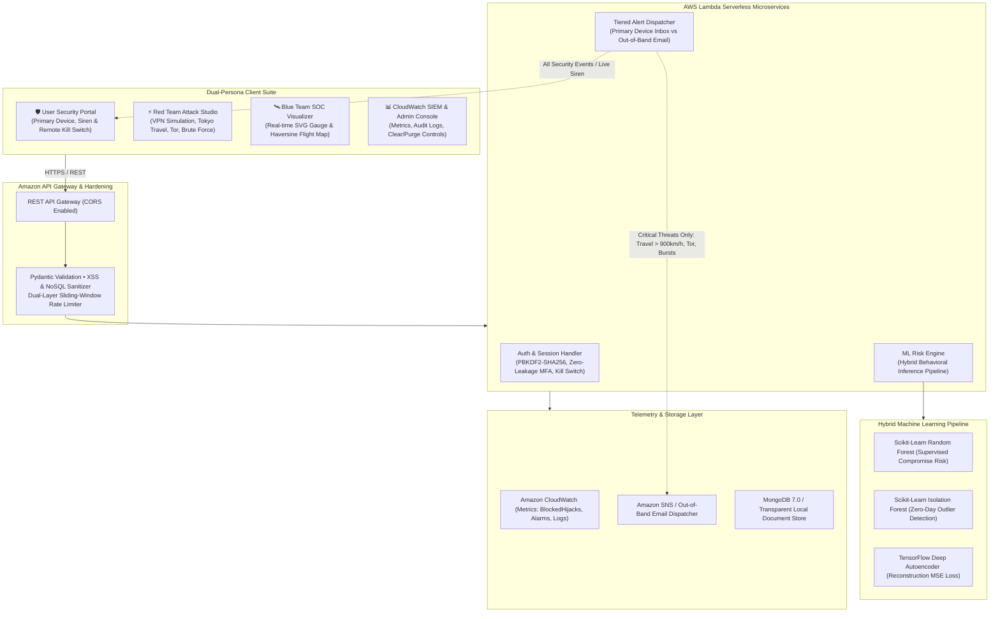

# 🛡️ Real-Time Account Hijacking Detection and Prevention System (AWSSecurity AI)

[](https://www.python.org/downloads/)
[](https://fastapi.tiangolo.com)
[](https://scikit-learn.org/)
[](https://aws.amazon.com/serverless/)
[](LICENSE)
[](#-automated-testing-suite)

A cloud-native cybersecurity platform built on AWS Serverless architecture that leverages **Continuous Behavioral Authentication** and a **Hybrid Machine Learning Pipeline** to detect, analyze, alert, and automatically block account takeover and session hijacking attempts in real time.

---

## 🏗️ System Architecture

Rather than trusting static passwords alone, incoming telemetry is evaluated on every session by an ensemble ML inference pipeline. The architecture enforces **Primary Device Authority**, **Zero-Data Leakage Challenges**, and **Tiered Intelligent Alert Routing**.



---

## 🧠 Multi-Layer Machine Learning Risk Engine

### 7-Dimensional Behavioral Feature Vector
Incoming sessions are transformed into a normalized behavioral vector comparing current telemetry against historical user baselines:

| Feature | Description | Anomaly Trigger |
| :--- | :--- | :--- |
| **`geo_velocity_kmh`** | Haversine velocity between successive logins | $> 900\text{ km/h}$ (Impossible Travel) |
| **`distance_km`** | Physical geographic distance from baseline | Sudden intercontinental shift |
| **`device_distance`** | Canvas fingerprint, OS, browser audio/WebGL divergence | Unrecognized hardware canvas ($> 0.5$) |
| **`ip_reputation`** | Tor exit relays, VPN endpoints, and datacenter proxies | Verified Tor exit node / Datacenter IP ($= 1.0$) |
| **`failed_attempts_burst`** | Velocity of recent failed password attempts | $> 3\text{ failed attempts in 10 min}$ |
| **`circadian_anomaly`** | Deviation from historical active login hours | Activity during anomalous off-hours ($> 0.6$) |
| **`bot_signature`** | Headless browser markers (`navigator.webdriver`, missing plugins) | Automated bot signature ($= 1.0$) |

### Hybrid Models & Inference Pipeline
1. **Scikit-Learn Random Forest Classifier**: Evaluates supervised compromise probability ($0 - 100\%$) trained on historical attack telemetry.
2. **Scikit-Learn Isolation Forest**: Identifies unsupervised zero-day behavioral anomalies and unrecognized vectors.
3. **TensorFlow Deep Neural Autoencoder (7-4-2-4-7)**: Measures reconstruction Mean Squared Error ($\text{MSE} > 0.12$) to flag subtle multi-variable drifts.
4. **Explainable AI (XAI)**: Generates human-readable factor attribution weights for every security event, identifying the exact root-cause drivers.

---

## ⚡ Adaptive Policy & Tiered Notification Architecture

To prevent notification fatigue while guaranteeing immediate reaction to genuine cyber threats, the system implements a **Human-Coverable Velocity Policy** and **Multi-Tier Notification Routing**:

```
+-----------------------------------------------------------------------------------+
|                            INCOMING SESSION TELEMETRY                             |
+-----------------------------------------------------------------------------------+
                                          |
                         [ Hybrid ML Risk Engine Evaluation ]
                                          |
            +-----------------------------+-----------------------------+
            |                                                           |
   Risk Score: 0 – 39                                          Risk Score: 40 – 69
[ Human-Coverable Distance / Normal ]                   [ Moderate Anomaly / New Device ]
            |                                                           |
       Action: ALLOW                                          Action: STEP_UP_MFA
  • Granted normal access                                • Adaptive 6-digit OTP challenge
  • Primary inbox logged (Silent)                        • Primary inbox notified
                                                         • Zero hardware leakage to client
                                                                        |
                                                                        v
                                                               Risk Score: 70 – 100
                                                        [ Critical Threat: Impossible Travel,
                                                          Tor Exit Node, Credential Stuffing ]
                                                                        |
                                                              Action: BLOCK_SESSION
                                                         • Session terminated instantly
                                                         • CloudWatch BlockedHijacks ++
                                                         • 🔊 Audible Siren on Primary Device
                                                         • 🚨 Primary Device Inbox Alert
                                                         • 📧 Out-of-Band Email to User
```

### Key Behavioral Rules:
1. **Human-Coverable Distance ($< 900\text{ km/h}$)**: If the user logs in from a neighboring city or normal commute distance within realistic transit times, the hybrid model handles access adaptively without panicking the user.
2. **Critical Threats ($\ge 70\text{ Risk Score}$)**: Sudden intercontinental jumps (e.g. New York to Tokyo in minutes, $> 8,500\text{ km/h}$), Tor relays, or brute-force bursts automatically trigger:
   - **Out-of-band email notifications** sent directly to the user's registered inbox.
   - **Audible siren alarm** and pulsing crimson warning in the Primary Security Portal.
   - **CloudWatch SIEM** alarm incrementation and SNS notification.
3. **In-App Device Inbox vs Email**: Routine session logins and secondary device enrollments notify the **Primary Device Inbox** directly, reserving **email alerts exclusively for high-severity/critical attacks** to eliminate alert fatigue.

---

## 🔒 Security Hardening & Zero-Trust Governance

- **Primary Device Authority**: Users register their master workstation. Secondary devices cannot kill or alter primary sessions; only the primary device holds the remote **Kill Switch** to revoke secondary sessions.
- **Zero-Data-Leakage MFA**: Challenge endpoints return only an opaque challenge ID and device type; hardware canvas fingerprints and master device labels are strictly withheld from unauthenticated callers.
- **PBKDF2-HMAC-SHA256**: 200,000 hashing rounds with 16-byte cryptographically secure per-user salts (`secrets.token_hex`).
- **Sliding-Window Rate Limiting**: Dual-layer rate limiting (per-IP and per-username) locks out brute-force guessing after 5 failures in 10 minutes while preserving loopback demo stability.
- **XSS & NoSQL Sanitization**: Recursive input sanitizer strips `<script>` tags, HTML event handlers, and NoSQL injection operators (`$where`, `$gt`, `$ne`, prototype pollution).
- **Clear & Purge Audit Controls**: Granular UI controls allowing authorized administrators to clear login event histories, security alerts, and reset demo baselines with confirmation modals.

---

## 🚀 Quick Start (Running Locally)

Zero AWS cloud dependencies or external databases required—includes a built-in local document database and CloudWatch SIEM telemetry emulator.

### Prerequisites
- Python 3.10+ (tested on Python 3.10 – 3.14)

### 1. Clone & Install
```bash
git clone https://github.com/rootnode-rebels/aws-security.git
cd aws-security

# Install dependencies
pip install -r requirements.txt
```

### 2. Run Automated Verification Tests
Verify that all 10 security, ML, and API test suites pass cleanly:
```bash
python -m unittest discover tests
```

### 3. Launch the Platform
```bash
python run_standalone.py
```
Open **`http://127.0.0.1:8000`** in your browser. *(Or use `docker-compose up --build`)*

### Seeded Demonstration Accounts
| Persona | Email | Password | Baseline Location |
| :--- | :--- | :--- | :--- |
| **Primary Demo User** | `demo@awssecurity.io` | `AWSSecurity#2026` | New York, US |
| **Legacy Demo User** | `demo@aegisguard.io` | `AegisGuard#2026` | New York, US |

*(New user registration is fully supported on the portal login card with automatic password transfer).*

---

## 🎯 Live Demonstration Guide (Two-Browser / VPN Test)

Demonstrate real-time account hijacking detection, impossible travel, and automated blocking on a single machine or with a VPN:

```
+------------------------------------+------------------------------------+
|   BROWSER 1: CHROME (PRIMARY)      |   BROWSER 2: EDGE / VPN (ATTACKER) |
|   Account: demo@awssecurity.io     |   Using Stolen Master Credentials  |
|   Location: New York (Baseline)    |   Location: Tokyo (VPN / Spoofed)  |
|   Role: Master Security Device     |   Action: Rogue Hijack Attempt     |
+------------------------------------+------------------------------------+
```

### Step 1: Legitimate User Baseline (Browser 1)
1. Open **`http://127.0.0.1:8000`** in **Google Chrome**.
2. Click **`👤 Fill Demo User (Sachin)`** and click **`Authenticate & Verify Session`**.
3. When the Primary Device modal appears, click **`🛡️ Yes, Register as My Primary Device`**.
4. The dashboard displays **`🛡️ Primary Security Portal (Master Device)`** with `🔊 Sound: ON` and active session monitoring.

### Step 2: Attacker Simulation (Browser 2 or Attack Studio)
**Option A — Using the Red Team Attack Studio:**
1. In Browser 2 (or another tab), open `http://127.0.0.1:8000` and click the **`⚡ Attack Simulator`** tab.
2. Select `demo@awssecurity.io` and click **`Launch Scenario`** under **Impossible Travel (Tokyo, 8,500 km/h)**.

**Option B — Live VPN / Second Device Test:**
1. Connect a second device (or browser through a VPN) to the app.
2. Attempt login using `demo@awssecurity.io` from the foreign location.

### Step 3: Observe Automated Defense in Browser 1
- **Audible Siren Alarm**: Browser 1 immediately sounds an urgent audio siren (`audio/siren.wav` / Web Audio synthesizer).
- **Red Alert Banner**: A pulsing crimson threat banner drops down with the attacker's details and velocity.
- **Security Inbox**: An alert appears with full **XAI Factor Attribution** (`geo_velocity_kmh: 99%`, `distance: 98%`).
- **Blue Team SOC**: The SVG risk needle spikes to 98/100, and the world map traces the impossible flight path.
- **Out-of-Band Email**: An automated high-priority email alert is dispatched for this critical incident.
- **Attacker Blocked**: The rogue session in Browser 2 receives an immediate **403 Forbidden** rejection.

---

## 🧪 Automated Testing Suite

The repository contains 10 comprehensive test suites covering unit tests, integration tests, impossible travel detection, multi-device governance, and bug audits:

```bash
# Run all test suites
python -m unittest discover tests

# Or run individual specialized suites:
python -m unittest tests/test_backend.py                  # Core REST API & rate limiting
python -m unittest tests/test_vpn_impossible_travel_flow.py # Live VPN & travel velocity tests
python -m unittest tests/test_primary_device_flow.py      # Master device kill switch & tokens
python -m unittest tests/test_primary_and_mfa.py         # Step-up MFA & zero-leakage challenges
python -m unittest tests/test_notification_service.py    # Primary inbox & out-of-band email dispatch
python -m unittest tests/test_background_notifications.py# Async notification queuing
python -m unittest tests/test_root_admin_demo_delete.py  # User deletion & admin reset controls
python -m unittest tests/test_user_reported_fixes.py     # Regression checks & security hardening
```

---

## ☁️ AWS Cloud Production Deployment

Deploy the complete serverless architecture to AWS using AWS SAM (`aws/template.yaml`):

```bash
cd aws
sam build
sam deploy --guided
```

### AWS Cloud Resources Provisioned:
- **Amazon API Gateway**: REST API with CORS, rate-limiting, and validation.
- **AWS Lambda Microservices**:
  - `AuthHandler`: PBKDF2 authentication, token signing, and session revocation.
  - `MLRiskEngine`: Hybrid behavioral scoring and anomaly detection.
  - `AlertDispatcher`: SNS notification routing and CloudWatch alarms.
- **Amazon CloudWatch**: Log group (`/aws/lambda/AccountHijackRiskEngine`), custom metrics (`BlockedHijacks`, `StepUpMFA`, `AllowSessions`), and `HighRiskRateAlarm`.
- **Amazon SNS**: Out-of-band push topic and email subscription dispatcher.

---

## 📁 Repository Structure

```
aws-security-main/
├── README.md                          # Comprehensive system documentation
├── PRACTICE.md                        # Viva defense guide, demo scripts & Q&A
├── requirements.txt                   # Production Python dependencies
├── run_standalone.py                  # Zero-AWS one-click standalone runner
├── docker-compose.yml                 # Containerized stack with MongoDB 7.0
├── aws/
│   ├── template.yaml                  # AWS SAM infrastructure as code
│   └── handlers/                      # Lambda serverless microservices
├── backend/
│   ├── app.py                         # FastAPI REST application & endpoints
│   ├── models.py                      # Scikit-Learn RF, Isolation Forest, Autoencoder
│   ├── security.py                    # PBKDF2 hashing, JWT signing, rate limiting
│   ├── sanitizer.py                   # XSS & NoSQL recursive sanitization
│   └── notification_service.py        # Tiered in-app & email notification router
├── database/
│   ├── db.py                          # Transparent local/MongoDB document store
│   └── schemas.py                     # User, session, event & telemetry schemas
├── frontend/
│   ├── index.html                     # Unified cyber defense dashboard
│   ├── css/style.css                  # Modern cyber-defense dark theme & glassmorphic UI
│   ├── js/
│   │   ├── user_portal.js             # User Portal, Primary Device & Session Kill Switch
│   │   ├── attack_simulator.js        # Red Team scenario launcher & attack builder
│   │   ├── soc_visualizer.js          # Blue Team gauge, SVG map & XAI breakdown
│   │   ├── telemetry.js               # CloudWatch metrics & log purge controls
│   │   └── notification_hub.js        # Web Audio siren & real-time inbox sync
│   └── assets/                        # Audio siren & cyber defense media
└── tests/
    ├── test_backend.py                # Core API & security tests
    ├── test_vpn_impossible_travel_flow.py # Impossible travel & VPN simulation
    ├── test_primary_device_flow.py    # Primary device authority & kill switch
    ├── test_primary_and_mfa.py        # Zero-leakage step-up MFA challenges
    ├── test_notification_service.py   # Tiered email vs inbox notification routing
    ├── test_background_notifications.py # Async alert queuing
    ├── test_root_admin_demo_delete.py # Admin purge & demo reset verification
    ├── test_user_reported_fixes.py    # Security hardening regression tests
    ├── test_live_scenario.py          # End-to-end multi-browser test
    └── audit_and_bug_checker.py       # Static codebase security auditor
```

---

## 📄 License
This project is licensed under the **MIT License**.

## 🚀 Execution & Environment Modes (`run_standalone.py`)

The platform includes a robust **Universal Runner** (`run_standalone.py`) designed to bridge the gap between local development, Dockerized staging, and AWS production environments seamlessly without requiring code changes. 

The application behavior dynamically scales based on the `DEPLOYMENT_MODE` environment variable:

| Mode | Database | Telemetry | MFA & Alerts | Auto-Reload | Port Bind |
| :--- | :--- | :--- | :--- | :--- | :--- |
| **`STANDALONE_LOCAL`** *(Default)* | Local `db.json` | Local File Logger | Simulated UI Toasts | ✅ Yes | `127.0.0.1:8000` |
| **`CONTAINER`** *(Docker)* | Local / Volumes | Local File Logger | Simulated UI Toasts | ❌ No | `0.0.0.0:8000` |
| **`AWS_ECS_PROD`** *(Production)* | Amazon DocumentDB | Amazon CloudWatch | Real AWS SNS / SES | ❌ No | `0.0.0.0:80` |

### Starting the Platform
```bash
# Standard Local Development
python run_standalone.py

# Docker Production Simulation
DEPLOYMENT_MODE=CONTAINER PORT=8000 python run_standalone.py
```

### 🐳 Docker & AWS ECS Integration
The included `Dockerfile` is optimized for **AWS Fargate** and **Elastic Container Service (ECS)**. 
- It uses a **multi-stage build** to keep the image incredibly lean, stripping unnecessary build tools before production deployment.
- A built-in `HEALTHCHECK` periodically pings the `/api/system/status` endpoint so AWS Load Balancers automatically cycle out unhealthy nodes.

```bash
# Build the production image locally
docker build -t aws-security:latest .

# Run the container locally mimicking AWS conditions
docker run -p 80:80 -e DEPLOYMENT_MODE="AWS_ECS_PROD" aws-security:latest
```

## 👥 Seeded Demonstration Accounts

For ease of testing during live presentations, the database automatically seeds specific Demo Personas upon first boot:

| Persona | Email | Password | Role |
| :--- | :--- | :--- | :--- |
| **Primary Demo User** | `demouser@mail.com` | `DemoUser.AWS@29` | Legitimate User |
| **Security Lead** | `demo@awssecurity.io` | `AWSSecurity#2026` | Root Admin |
| **Legacy Account** | `demo@aegisguard.io` | `AegisGuard#2026` | Root Admin |

*(Note: In `STANDALONE_LOCAL` mode, to prevent login frustration, MFA verification codes are dynamically exposed directly in the UI. In `AWS_ECS_PROD`, these are securely dispatched via Amazon SNS).*
