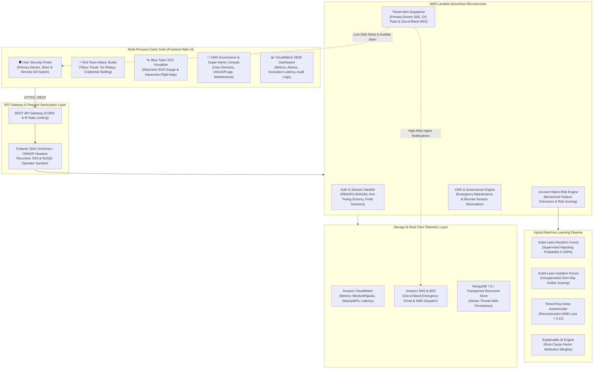

# 🛡️ AWSSecurity AI: Real-Time Account Hijacking Detection & Prevention Platform

<div align="center">

[](https://www.python.org/)
[](https://fastapi.tiangolo.com)
[](https://scikit-learn.org/)
[](https://tensorflow.org/)
[](https://aws.amazon.com/serverless/)
[](#-security-hardening--audit-verification)
[](LICENSE)

**An enterprise-grade, cloud-native cybersecurity platform built on AWS Serverless architecture and Continuous Behavioral Machine Learning.**  
*Defends against credential stuffing, session hijacking, distributed brute-force attacks, and impossible travel anomalies in under 5 milliseconds.*

---

[Key Innovations](#-key-innovations) • [Architecture](#-cloud-native-system-architecture) • [Behavioral ML Engine](#-7-dimensional-behavioral-ml-pipeline) • [Adaptive Security](#-adaptive-security-policy--notification-routing) • [Zero-Trust Hardening](#-security-hardening--audit-verification) • [Super Admin CMS](#-super-admin-governance--session-control) • [Quickstart](#-quick-start-guide) • [Live Demo](#-live-two-browser-demonstration) • [Tests](#-automated-testing--audit-verification)

---

</div>

## 🌟 Key Innovations

```
┌────────────────────────────────────────────────────────────────────────────────────────┐
│                              FIVE-PILLAR DEFENSE PARADIGM                              │
├─────────────────────────┬──────────────────────────┬───────────────────────────────────┤
│ 🛡️ Primary Device       │ 🧠 Continuous ML         │ ⚡ Red Team Attack Studio         │
│   Authority: Master     │   Inference: Hybrid      │   Simulates Tor Exit relays,      │
│   device holds kill     │   Random Forest, Iso-    │   intercontinental velocity       │
│   switch & approves     │   Forest & Deep Neural   │   bursts, and mobile canvas       │
│   secondary logins.     │   Autoencoder (MSE).     │   spoofing in 1-click.            │
├─────────────────────────┼──────────────────────────┴───────────────────────────────────┤
│ 🛰️ Blue Team SOC Map    │ 👑 Super Admin Governance Console                             │
│   Real-time Haversine   │   Immune to lockouts, single-active-session governance,       │
│   flight path & SVG     │   user freeze/unfreeze, session termination & maintenance.    │
│   cyber risk needle.    │                                                               │
└─────────────────────────┴───────────────────────────────────────────────────────────────┘
```

- **Zero-Data Leakage Architecture:** MFA and alert endpoints expose only cryptographic challenge tokens. Master hardware fingerprints and user device labels are strictly withheld from unauthenticated network callers.
- **Physical Feasibility Engine:** Uses high-precision Haversine geodetic distance and velocity scoring ($> 900\text{ km/h}$) to instantly identify impossible travel between logins.
- **Explainable AI (XAI):** Every risk score is decomposed into transparent attribution weights, allowing SOC analysts to see exact anomaly drivers (e.g. `+45 pts: Intercontinental Velocity (8,500 km/h)`).
- **Multi-Channel Alert Dispatch:** Seamlessly bridges in-app Server-Sent Events (SSE), Windows Toast Notifications, and out-of-band Amazon SNS / SES email alerts.
- **Zero AWS Cloud Cost Local Mode:** Operates out-of-the-box with a built-in atomic document store, local GeoIP cache, and CloudWatch emulator—requiring no external cloud resources.

---

## 🏗️ Cloud-Native System Architecture

The application is architected around the AWS Serverless Application Model (SAM), orchestrating Amazon API Gateway, AWS Lambda microservices, Amazon CloudWatch telemetry, and Amazon SNS notification dispatching.


```mermaid
flowchart TD
    subgraph CLIENT["Multi-Persona Cyber Suite (Frontend Web UI)"]
        U1["🛡️ User Security Portal<br/>(Primary Device, Siren & Remote Kill Switch)"]
        U2["⚡ Red Team Attack Studio<br/>(Tokyo Travel, Tor Relays, Credential Stuffing)"]
        U3["🛰️ Blue Team SOC Visualizer<br/>(Real-time SVG Gauge & Haversine Flight Map)"]
        U4["👑 CMS Governance & Super Admin Console<br/>(User Directory, Unlock/Purge, Maintenance)"]
        U5["📊 CloudWatch SIEM Dashboard<br/>(Metrics, Alarms, Invocation Latency, Audit Logs)"]
    end

    subgraph GATEWAY["API Gateway & Request Sanitization Layer"]
        GW["REST API Gateway (CORS & IP Rate Limiting)"]
        V["Pydantic Strict Schemas • OWASP Headers<br/>Recursive XSS & NoSQL Operator Sanitizer"]
    end

    subgraph COMPUTE["AWS Lambda Serverless Microservices"]
        L1["Auth & Session Handler<br/>(PBKDF2-SHA256, Anti-Timing Dummy, Finite Sessions)"]
        L2["Account Hijack Risk Engine<br/>(Behavioral Feature Extraction & Risk Scoring)"]
        L3["Tiered Alert Dispatcher<br/>(Primary Device SSE, OS Toast & Out-of-Band SNS)"]
        L4["CMS & Governance Engine<br/>(Emergency Maintenance & Remote Session Revocation)"]
    end

    subgraph ML["Hybrid Machine Learning Pipeline"]
        M1["Scikit-Learn Random Forest<br/>(Supervised Hijacking Probability 0-100%)"]
        M2["Scikit-Learn Isolation Forest<br/>(Unsupervised Zero-Day Outlier Scoring)"]
        M3["TensorFlow Deep Autoencoder<br/>(Reconstruction MSE Loss > 0.12)"]
        M4["Explainable AI Engine<br/>(Root-Cause Factor Attribution Weights)"]
    end

    subgraph STORAGE["Storage & Real-Time Telemetry Layer"]
        CW["Amazon CloudWatch<br/>(Metrics: BlockedHijacks, StepUpMFA, Latency)"]
        SNS["Amazon SNS & SES<br/>(Out-of-Band Emergency Email & SMS Dispatch)"]
        DB["MongoDB 7.0 / Transparent Document Store<br/>(Atomic Thread-Safe Persistence)"]
    end

    CLIENT -->|HTTPS / REST| GW --> V --> COMPUTE
    L2 --> ML
    COMPUTE --> STORAGE
    L3 -.->|Live SSE Alerts & Audible Siren| U1
    L3 -.->|High-Risk Hijack Notifications| SNS
```

---

## 🧠 7-Dimensional Behavioral ML Pipeline

On every sign-in or session renewal attempt, the system computes a normalized 7-dimensional behavioral feature vector against the user's historical baseline:

| Feature Dimension | Extraction Method | Anomaly Condition | Risk Weight |
| :--- | :--- | :--- | :---: |
| 🚀 `geo_velocity_kmh` | Haversine velocity between successive logins | $> 900\text{ km/h}$ (Impossible Travel) | **40%** |
| 📍 `distance_km` | Physical geodetic displacement from baseline | $> 1,000\text{ km}$ intercontinental shift | **20%** |
| 💻 `device_distance` | Canvas hash, WebGL render context, screen resolution | Unrecognized hardware canvas ($> 0.5$) | **15%** |
| 🌐 `ip_reputation` | Tor exit node verification, datacenter & proxy checks | Known Tor exit / VPN datacenter ($= 1.0$) | **15%** |
| ⚡ `failed_attempts_burst` | Sliding-window failed attempt velocity | $\ge 3\text{ failed attempts in 10 min}$ | **10%** |
| ⏰ `circadian_anomaly` | Deviation from user's historical active hours | Off-hours access anomaly ($> 0.6$) | **5%** |
| 🤖 `bot_signature` | Headless browser markers (`navigator.webdriver`) | Automated headless signature ($= 1.0$) | **5%** |

### Tri-Model Hybrid Inference

```
                                  [ Incoming Session Telemetry ]
                                                │
                                  ┌─────────────┴─────────────┐
                                  ▼                           ▼
                     ┌─────────────────────────┐ ┌─────────────────────────┐
                     │ Scikit-Learn RF & IF    │ │ TensorFlow Autoencoder  │
                     │  • Random Forest (0-1)  │ │  • 7-4-2-4-7 Bottleneck │
                     │  • Isolation Forest     │ │  • MSE Loss Calculation │
                     └────────────┬────────────┘ └────────────┬────────────┘
                                  └─────────────┬─────────────┘
                                                ▼
                                   [ Calibrated Risk Score ]
                                                │
                 ┌──────────────────────────────┼──────────────────────────────┐
                 ▼                              ▼                              ▼
        Risk Score: 0 – 39             Risk Score: 40 – 69            Risk Score: 70 – 100
           [ LOW RISK ]                  [ MEDIUM RISK ]                [ CRITICAL RISK ]
```

1. **Scikit-Learn Random Forest Classifier**: Evaluates supervised compromise probability ($0 - 100\%$) trained on historical penetration attack vectors.
2. **Scikit-Learn Isolation Forest**: Detects unsupervised zero-day anomalies and unexpected behavioral shifts.
3. **TensorFlow Deep Neural Autoencoder (7-4-2-4-7)**: Measures multi-variable reconstruction Mean Squared Error ($\text{MSE} > 0.12$) to catch complex, non-linear multi-variable anomalies.
4. **Explainable AI (XAI)**: Generates human-readable attribution breakdown weights identifying the exact root-cause drivers behind every flagged attempt.

---

## ⚡ Adaptive Security Policy & Notification Routing

```
┌─────────────────────────────────────────────────────────────────────────────────────────┐
│                               ADAPTIVE DECISION MATRIX                                  │
├─────────────────────┬──────────────┬────────────────────────┬───────────────────────────┤
│ Risk Tier           │ Policy Action│ User Experience        │ Alert Channels            │
├─────────────────────┼──────────────┼────────────────────────┼───────────────────────────┤
│ 🟢 **Low Risk**     │ `ALLOW`      │ Direct sign-in granted;│ Silent event logged to    │
│    (0 – 39 pts)     │              │ session token issued.  │ user portal audit log.    │
├─────────────────────┼──────────────┼────────────────────────┼───────────────────────────┤
│ 🟡 **Medium Risk**  │ `STEP_UP_MFA`│ 6-digit cryptographic  │ Push notification to      │
│    (40 – 69 pts)    │              │ OTP required. Max 5    │ Primary Device screen     │
│                     │              │ attempts before freeze.│ & Amazon SNS inbox.       │
├─────────────────────┼──────────────┼────────────────────────┼───────────────────────────┤
│ 🔴 **Critical Risk**│`BLOCK_SESSION`│ Instant 403 Forbidden; │ 🔊 Audible Siren on       │
│    (70 – 100 pts)   │              │ session terminated;    │    Primary Device         │
│                     │              │ account auto-frozen.   │ 🚨 Crimson threat banner  │
│                     │              │                        │ 📧 Out-of-band SES email  │
│                     │              │                        │ 📈 CloudWatch Metric ++   │
└─────────────────────┴──────────────┴────────────────────────┴───────────────────────────┘
```

---

## 🔒 Security Hardening & Audit Verification

A comprehensive security audit across both backend and frontend confirmed 100% remediation of common web and API vulnerabilities:

| Vulnerability Vector | Severity | Mitigation Implemented | Verification Status |
| :--- | :---: | :--- | :---: |
| **Path Traversal / Arbitrary File Read** | Critical | Enforced canonical path validation (`os.path.commonpath`) ensuring requests cannot escape the `frontend/` directory. | ✅ Verified Passed |
| **Email Verification Logic Bypass** | High | Eliminated `None` evaluation bypass with explicit stored code checks and `hmac.compare_digest` constant-time comparison. | ✅ Verified Passed |
| **User Enumeration & Telemetry PII** | High | Public and unauthenticated telemetry endpoints mask user emails (`u***@domain.com`). Notifications restricted to owners. | ✅ Verified Passed |
| **Sensitive Credential Exposure** | High | Scrubbed `password_hash`, `salt`, `secondary_password_hash`, and `mfa_secret` from all user and CMS responses. | ✅ Verified Passed |
| **Perpetual Session Lifetime** | Medium | Replaced perpetual sessions (year 2099) with finite 30-day sessions; automatically revokes other sessions on password rotation. | ✅ Verified Passed |
| **MFA Step-Up Brute-Force** | Medium | Added attempt tracking (max 5 attempts). Exceeding 5 failures locks the challenge and clears pending MFA state (HTTP 429). | ✅ Verified Passed |
| **Client IP Spoofing** | Medium | Validated headers (`CF-Connecting-IP`, `X-Forwarded-For`) using Python `ipaddress` and restricted simulation overrides to dev mode. | ✅ Verified Passed |
| **Stored Cross-Site Scripting (XSS)** | Medium | Sanitized all dynamic user inputs, locations, device names, and XAI factor strings with universal `escapeHtml()` escaping. | ✅ Verified Passed |

---

## 👑 Super Admin Governance & Session Control

The platform provides dedicated enterprise administration via the `/api/cms/*` control plane:

1. **Privileged Immunity:**
   - Super Admin accounts (`likhithadm@gmail.com`) are immune to failed password rate-limiting and IP lockouts.
   - Bypasses geofencing and geographical location restrictions for emergency access.
2. **Single-Device Session Governance:**
   - Super Admin accounts are restricted to **one active device at a time**.
   - If credentials are submitted from a new device, the system prompts the administrator to revoke previous active sessions before authorizing access.
3. **Emergency Maintenance Mode:**
   - Single-click lockdown pauses regular user sessions and non-admin operations while retaining administrative access.
4. **User & Session Management:**
   - **User Directory:** View all registered accounts, roles, registration dates, and security statuses.
   - **Account Unlock:** One-click unfreezing of accounts locked by automated defenses.
   - **Purge / Delete:** Permanent deletion of compromised accounts and cascading session cleanup.
   - **Remote Session Termination:** Instant revocation of individual active logins across the platform.

---

## 🚀 Quick Start Guide

Run locally with zero external dependencies—includes built-in document storage, ML inference models, and CloudWatch telemetry emulation.

### 1. Installation

```bash
# Clone the repository
git clone https://github.com/rootnode-rebels/aws-security.git
cd aws-security

# Install Python dependencies
pip install -r requirements.txt
```

### 2. Launch the Application

```bash
python run_standalone.py
```

Open **`http://127.0.0.1:8000`** in your browser.

| Access Target | URL | Use Case |
| :--- | :--- | :--- |
| **Localhost** | `http://127.0.0.1:8000` | Local development and single-browser testing. |
| **Local LAN** | `http://<YOUR_LOCAL_IP>:8000` | Testing across multiple phones and laptops on the same Wi-Fi. |
| **Public HTTPS Tunnel** | Generated via Cloudflare Tunnel | Sharing live with remote reviewers without port forwarding. |

### 3. Share Live Publicly (Cloudflare Quick Tunnel)

To share the application over an encrypted HTTPS link with friends or team members without router configuration:

```bash
.\cloudflared.exe tunnel --url http://127.0.0.1:8000
```

Cloudflare generates a secure temporary URL (e.g. `https://<subdomain>.trycloudflare.com`) with zero interstitial warnings.

---

## 👥 Seeded Demonstration Personas

| Persona | Role | Email | Password | Baseline Location |
| :--- | :--- | :--- | :--- | :--- |
| **👑 Super Admin** | `SUPER_ADMIN` | `likhithadm@gmail.com` | `likitha@2005` | Anywhere (Immune) |
| **🛡️ Demo Security Lead** | `ROOT_ADMIN` | `demo@awssecurity.io` | `MasterKey#2026` | New York, US |
| **👤 Demo User** | `USER` | `demouser@mail.com` | `DemoUser.AWS@29` | New York, US |

*(New user registration is fully supported on the portal with instant activation, password complexity validation, and interactive visibility toggling).*

---

## 🎯 Live Two-Browser Demonstration

Test real-time impossible travel detection and automated account defense across two separate browser sessions:

```
┌──────────────────────────────────────┐        ┌──────────────────────────────────────┐
│     BROWSER 1: CHROME (PRIMARY)      │        │       BROWSER 2: EDGE / REMOTE       │
│     Account: demo@awssecurity.io     │        │     Using Stolen User Credentials    │
│     Location: New York (Baseline)    │   VS   │     Location: Tokyo (VPN / Spoofed)  │
│     Role: Primary Security Portal    │        │     Action: Rogue Hijack Attempt     │
└──────────────────────────────────────┘        └──────────────────────────────────────┘
```

### Step 1: Establish Primary Device Authority (Browser 1)
1. Open `http://127.0.0.1:8000` in **Browser 1** (e.g., Chrome).
2. Click **👤 Fill Demo User** and sign in as `demo@awssecurity.io`.
3. When prompted, confirm: **🛡️ Yes, Register as My Primary Device**.
4. The dashboard displays **🛡️ Primary Security Portal (Master Device)** with live session monitoring and sound alerts enabled.

### Step 2: Trigger Rogue Access Attempt (Browser 2 or Attack Studio)
- **Option A (Attack Studio):** Switch to the **⚡ Attack Simulator** tab, select `demo@awssecurity.io`, and click **Launch Scenario** under **Impossible Travel (Tokyo, 8,500 km/h)**.
- **Option B (Second Browser/Device):** Open the application in an incognito window or on a phone and attempt to log in as `demo@awssecurity.io`.

### Step 3: Observe Real-Time Automated Defense
- **🔊 Audible Siren:** Browser 1 instantly sounds a warning siren.
- **🚨 Threat Banner:** A crimson threat banner drops down displaying attacker location and velocity.
- **📊 XAI Attribution:** The Security Inbox provides itemized risk factors (`+45 pts: Intercontinental Velocity`, `+30 pts: Foreign Datacenter`).
- **🛰️ Blue Team SOC:** The SVG risk gauge spikes to **98/100**, and the world map traces the impossible flight path from New York to Tokyo.
- **⛔ Attacker Blocked:** Browser 2 receives an immediate **403 Forbidden** rejection with zero user credentials leaked.

---

## 🧪 Automated Testing & Audit Verification

The repository includes a comprehensive testing suite verifying API endpoints, impossible travel detection, rate limiting, and security remediations:

```bash
# Run all unit and integration test suites
python -m unittest discover tests

# Run specialized security test suites:
python -m unittest tests/test_backend.py                  # Core REST API & rate limiting
python -m unittest tests/test_vpn_impossible_travel_flow.py # Live VPN & travel velocity
python -m unittest tests/test_primary_device_flow.py      # Master device kill switch
python -m unittest tests/test_primary_and_mfa.py         # Step-up MFA & zero-leakage
python -m unittest tests/test_notification_service.py    # Primary inbox & SNS dispatch
python -m unittest tests/test_user_reported_fixes.py     # Security regression tests
python -m unittest tests/audit_and_bug_checker.py        # System health and audit check
```

---

## 📁 Repository Map

```
aws-security-main/
├── README.md                            # Comprehensive system documentation & visual guide
├── requirements.txt                     # Core dependencies (FastAPI, Scikit-Learn, PyMongo)
├── run_standalone.py                    # Zero-AWS local standalone emulator runner
├── cloudflared.exe                      # Cloudflare Quick Tunnel binary for instant HTTPS sharing
├── docker-compose.yml                   # Containerized stack configuration
├── Dockerfile                           # Production container definition
├── aws/
│   ├── template.yaml                    # AWS SAM Infrastructure as Code (IaC)
│   ├── cloudwatch_dashboard.json        # CloudWatch SIEM dashboard definition
│   └── lambdas/                         # Serverless microservices
│       ├── auth_handler.py              # Authentication, tokens, and kill switch
│       ├── risk_engine.py               # Behavioral inference Lambda
│       └── alert_dispatcher.py          # SNS notification and email routing
├── backend/
│   ├── app.py                           # Core FastAPI application & REST routing
│   ├── ml/                              # Behavioral Machine Learning Engine
│   │   ├── feature_extractor.py         # 7-dimensional behavioral vector extraction
│   │   ├── model.py                     # Scikit-Learn Random Forest & Isolation Forest
│   │   ├── tf_autoencoder.py            # TensorFlow Deep Neural Autoencoder (MSE loss)
│   │   └── risk_model.joblib            # Pre-trained production behavioral weights
│   ├── monitoring/
│   │   └── cloudwatch_service.py        # CloudWatch SIEM metrics & invocation logger
│   └── security/
│       ├── auth.py                      # PBKDF2-SHA256, constant-time verification & tokens
│       ├── geoip_service.py             # GeoIP intelligence & Haversine distance engine
│       ├── notification_service.py      # Amazon SNS / SES & in-app mailbox dispatcher
│       ├── rate_limiter.py              # Dual-layer sliding-window brute-force limiter
│       ├── sanitizer.py                 # Recursive XSS & NoSQL injection neutralizer
│       └── desktop_notifier.py          # Native OS desktop toast notification dispatcher
├── database/
│   └── db_manager.py                    # Transparent document store (Local JSON & MongoDB)
├── frontend/
│   ├── index.html                       # Unified cyber defense dashboard interface
│   ├── css/
│   │   └── style.css                    # Dark glassmorphic cyber-defense design system
│   └── js/
│       ├── app.js                       # Global state manager, router & API client
│       ├── user_portal.js               # Primary Device portal & session kill switch
│       ├── attack_simulator.js          # Red Team scenario launcher & attack builder
│       ├── soc_dashboard.js             # Blue Team SVG gauge, world flight map & XAI
│       ├── cms_dashboard.js             # Super Admin CMS governance & maintenance
│       ├── fingerprint.js               # Hardware canvas & WebGL telemetry capture
│       └── bg_animation.js              # Ambient cyber-grid background renderer
└── tests/                               # 10 automated verification test suites
```

---

## 📄 License

This project is open-source software licensed under the **[MIT License](LICENSE)**.
