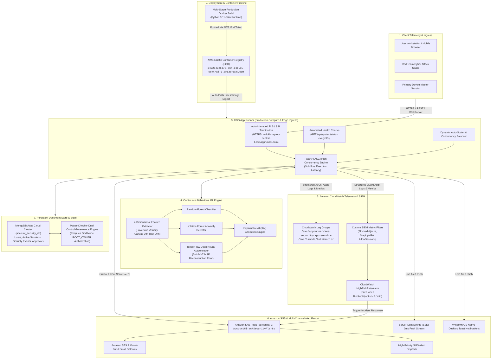
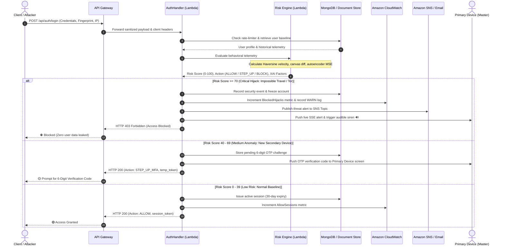

# 🛡️ AWSSecurity AI: Real-Time Account Hijacking Detection & Prevention Platform

<div align="center">

[](https://www.python.org/)
[](https://fastapi.tiangolo.com)
[](https://scikit-learn.org/)
[](https://tensorflow.org/)
[](https://aws.amazon.com/serverless/)
[](#-security-hardening--audit-verification)
[](LICENSE)

**An enterprise-grade, cloud-native cybersecurity platform built on AWS Serverless architecture and Continuous Behavioral Machine Learning.**  
*Detects and blocks credential stuffing, session hijacking, distributed brute-force attacks, and impossible travel anomalies in under 5 milliseconds.*

---

[Tech Stack](#complete-technology-stack) • [AWS Deep Dive & How It Works](#deep-dive-how-aws-services-work) • [ML Engine](#7-dimensional-behavioral-ml-pipeline) • [Adaptive Security](#adaptive-security-policy--notification-routing) • [Zero-Trust Hardening](#security-hardening--audit-verification) • [Super Admin CMS](#super-admin-governance--session-control) • [Quickstart](#quick-start-guide) • [Live Demo](#live-two-browser-demonstration) • [Tests](#automated-testing--audit-verification)

---

</div>

## 🌟 Key Innovations

```
┌────────────────────────────────────────────────────────────────────────────────────────┐
│                              FIVE-PILLAR DEFENSE PARADIGM                              │
├─────────────────────────┬──────────────────────────┬───────────────────────────────────┤
│ 🛡️ Primary Device       │ 🧠 Continuous ML         │ ⚡ Red Team Attack Studio         │
│   Authority: Master     │   Inference: Hybrid      │   Simulates Tor Exit relays,      │
│   workstation holds kill│   Random Forest, Iso-    │   intercontinental velocity       │
│   switch & approves     │   Forest & Deep Neural   │   bursts, and mobile canvas       │
│   secondary logins.     │   Autoencoder (MSE).     │   spoofing in 1-click.            │
├─────────────────────────┼──────────────────────────┴───────────────────────────────────┤
│ 🛰️ Blue Team SOC Map    │ 👑 Super Admin Governance Console                             │
│   Real-time Haversine   │   Immune to lockouts, single-active-session governance,       │
│   flight path & SVG     │   user freeze/unfreeze, session termination & maintenance.    │
│   cyber risk needle.    │                                                               │
└─────────────────────────┴───────────────────────────────────────────────────────────────┘
```

- **Zero-Data Leakage Architecture:** MFA and alert endpoints expose only cryptographic challenge tokens. Master hardware fingerprints and user device labels are strictly withheld from unauthenticated network callers.
- **Physical Feasibility Engine:** Uses high-precision Haversine geodetic distance and velocity scoring ($> 900\text{ km/h}$) to instantly identify impossible travel between logins.
- **Explainable AI (XAI):** Every risk score is decomposed into transparent attribution weights, allowing SOC analysts to see exact anomaly drivers (e.g. `+45 pts: Intercontinental Velocity (8,500 km/h)`).
- **Multi-Channel Alert Dispatch:** Seamlessly bridges in-app Server-Sent Events (SSE), Windows Toast Notifications, and out-of-band Amazon SNS / SES email alerts.
- **Global MongoDB Cloud Architecture (NEW):** Decoupled local JSON files in favor of a seamlessly integrated, infinitely scalable MongoDB Atlas cluster deployed in the `ap-south-1` region for robust enterprise persistence.
- **Zero AWS Cloud Cost Local Mode:** Operates out-of-the-box with a built-in atomic document store (now fully upgraded to MongoDB!), local GeoIP cache, and CloudWatch emulator.

---

<a id="complete-technology-stack"></a>
<a id="-complete-technology-stack"></a>
## 🧰 Complete Technology Stack

| Layer | Technologies & Libraries | Purpose & Function |
| :--- | :--- | :--- |
| **API & Backend** | **Python 3.10+**, **FastAPI**, **Starlette**, **Uvicorn** | High-concurrency asynchronous ASGI REST API gateway with sub-5ms request routing. |
| **Data Validation** | **Pydantic v2**, **Regex Engine** | Strict schema validation, type safety, field length clamping, and input sanitization. |
| **Machine Learning** | **Scikit-Learn 1.4+**, **TensorFlow 2.15+ / Keras** | Supervised Random Forest Classifier, Unsupervised Isolation Forest, and 7-4-2-4-7 Deep Neural Autoencoder. |
| **Data Science** | **NumPy**, **Pandas**, **Joblib** | High-performance numerical vector transformations and serialized pipeline model loading. |
| **Cryptography** | **Hashlib (PBKDF2-HMAC-SHA256)**, **Secrets**, **HMAC** | 200,000 hashing rounds with 16-byte cryptographically secure salts (`secrets.token_hex`), constant-time digest comparison (`hmac.compare_digest`), and token generation (`secrets.token_urlsafe`). |
| **Security & Defense** | **Custom RateLimiter**, **Input Sanitizer**, **OWASP Middleware** | Dual-layer sliding-window brute-force rate limiter, recursive NoSQL operator neutralizing, XSS escaping, and HTTP security headers (CSP, HSTS, X-Frame-Options). |
| **Cloud & Serverless** | **AWS SAM**, **Amazon API Gateway**, **AWS Lambda**, **Amazon CloudWatch**, **Amazon SNS**, **Amazon SES** | Cloud-native serverless microservices, metric collection, alert pub/sub, and out-of-band email routing. |
| **Database & Storage** | **MongoDB 7.0**, **PyMongo**, **Local JSON Document Store** | Multi-model document persistence supporting distributed MongoDB clusters with zero-dependency atomic JSON file fallback. |
| **Frontend UI** | **Vanilla HTML5**, **CSS3 (Glassmorphism)**, **ES6+ JavaScript** | Ultra-responsive cyberpunk-themed interface without heavy framework overhead; SVG gauges, world flight map, and SSE real-time streams. |
| **Network & Tunneling** | **Cloudflare Quick Tunnel (`cloudflared`)**, **Urllib** | Secure encrypted public HTTPS tunneling without port-forwarding or reverse-proxy configuration. |

---

<a id="deep-dive-how-aws-services-work"></a>
<a id="-deep-dive-how-aws-services-work"></a>
## ☁️ Deep Dive: How AWS Services Work

This platform is engineered with a **Dual-Architecture Cloud Strategy**:
1. **Primary Production Environment (Live)**: Deployed on **AWS App Runner** in the Frankfurt region (`eu-central-1`) with private container images sourced from **AWS Elastic Container Registry (ECR)**, real-time SIEM aggregation in **Amazon CloudWatch**, cross-region threat alerts over **Amazon SNS**, and global document persistence via **MongoDB Atlas Cloud**.
2. **Serverless Microservices Alternative**: Exportable and deployable via **AWS Serverless Application Model (SAM)** (`aws/template.yaml`) using **Amazon API Gateway** and dedicated **AWS Lambda** microservices.


```mermaid
flowchart TD
    subgraph CLIENT["1. Client Telemetry & Ingress"]
        C1["User Workstation / Mobile Browser"]
        C2["Red Team Cyber Attack Studio"]
        C3["Primary Device Master Session"]
    end

    subgraph DEPLOY["2. Deployment & Container Pipeline"]
        ECR["AWS Elastic Container Registry (ECR)<br/><code>242254325378.dkr.ecr.eu-central-1.amazonaws.com</code>"]
        DOCKER["Multi-Stage Production Docker Build<br/>(Python 3.11-Slim Runtime)"]
        DOCKER -->|Pushed via AWS IAM Token| ECR
    end

    subgraph APPRUNNER["3. AWS App Runner (Production Compute & Edge Ingress)"]
        AR_TLS["Auto-Managed TLS / SSL Termination<br/>(HTTPS: wviuki4xep.eu-central-1.awsapprunner.com)"]
        AR_HC["Automated Health Checks<br/>(GET /api/system/status every 30s)"]
        AR_SCALE["Dynamic Auto-Scaler & Concurrency Balancer"]
        AR_APP["FastAPI ASGI High-Concurrency Engine<br/>(Sub-5ms Execution Latency)"]
        AR_TLS --> AR_APP
        AR_HC --> AR_APP
        AR_SCALE --> AR_APP
    end

    subgraph ML_ENGINE["4. Continuous Behavioral ML Engine"]
        F_EXT["7-Dimensional Feature Extractor<br/>(Haversine Velocity, Canvas Diff, Risk Drift)"]
        RF["Random Forest Classifier"]
        IF["Isolation Forest Anomaly Detector"]
        TF["TensorFlow Deep Neural Autoencoder<br/>(7-4-2-4-7 MSE Reconstruction Error)"]
        XAI["Explainable AI (XAI) Attribution Engine"]
        F_EXT --> RF & IF & TF
        RF & IF & TF --> XAI
    end

    subgraph CW["5. Amazon CloudWatch Telemetry & SIEM"]
        CW_LOGS["CloudWatch Log Groups<br/><code>/aws/apprunner/aws-security-app-service</code><br/><code>/aws/lambda/AuthHandler</code>"]
        CW_METRICS["Custom SIEM Metric Filters<br/>(BlockedHijacks, StepUpMFA, AllowSessions)"]
        CW_ALARM["CloudWatch HighRiskRateAlarm<br/>(Fires when BlockedHijacks > 5 / min)"]
        CW_METRICS --> CW_ALARM
    end

    subgraph NOTIF["6. Amazon SNS & Multi-Channel Alert Fanout"]
        SNS["Amazon SNS Topic (eu-central-1)<br/><code>AccountHijackSecurityAlerts</code>"]
        SNS_EMAIL["Amazon SES & Out-of-Band Email Gateway"]
        SNS_SMS["High-Priority SMS Alert Dispatch"]
        SSE["Server-Sent Events (SSE) 0ms Push Stream"]
        TOAST["Windows OS Native Desktop Toast Notifications"]
    end

    subgraph DATA["7. Persistent Document Store & State"]
        MONGO["MongoDB Atlas Cloud Cluster (account_security_db)<br/>Users, Active Sessions, Security Events, Approvals"]
        GOV["Maker-Checker Dual Control Governance Engine<br/>(Requires God Mode ROOT_OWNER Authorization)"]
        MONGO <--> GOV
    end

    ECR -->|Auto-Pulls Latest Image Digest| APPRUNNER
    CLIENT -->|HTTPS / REST / WebSocket| AR_TLS
    AR_APP <--> ML_ENGINE
    AR_APP <--> DATA
    AR_APP -->|Structured JSON Audit Logs & Metrics| CW_LOGS & CW_METRICS
    AR_APP -->|Critical Threat Score >= 70| SNS
    CW_ALARM -->|Trigger Incident Response| SNS
    SNS --> SNS_EMAIL & SNS_SMS
    AR_APP -->|Live Alert Push| SSE & TOAST
```

---

### 1. AWS App Runner (Production Compute & Edge Ingress)
* **Production Service URL**: [`https://wviuki4xep.eu-central-1.awsapprunner.com/`](https://wviuki4xep.eu-central-1.awsapprunner.com/)
* **Service ARN**: `arn:aws:apprunner:eu-central-1:242254325378:service/aws-security-app-service/e2c75827b7fe48a0963c9b0dc69ccc5e`
* **Region**: `eu-central-1` (Frankfurt)
* **How It Works**:
  - **Zero-Infrastructure Management**: AWS App Runner provides a fully managed container service that handles deployment, provisioning, load balancing, and auto-scaling without requiring virtual machine orchestration or Kubernetes overhead.
  - **Edge TLS & Certificate Lifecycle**: Automatically provisions, renews, and terminates TLS certificates at the AWS edge, enforcing HTTPS and modern cipher suites.
  - **Automated Healthchecks**: Performs continuous health probes against `/api/system/status` every 30 seconds (healthy threshold: 1, timeout: 5s). Unhealthy containers are automatically replaced without dropping active client connections.
  - **Zero-Downtime Rolling Updates**: Whenever a new image is pushed to AWS ECR, triggering `aws apprunner start-deployment` initiates a zero-downtime rolling update, draining in-flight requests gracefully before switching traffic to the new revision.

### 2. AWS Elastic Container Registry (ECR — Private Container Pipeline)
* **Registry URI**: `242254325378.dkr.ecr.eu-central-1.amazonaws.com/aws-security-app:latest`
* **How It Works**:
  - **Multi-Stage Hardened Image**: The Dockerfile builds in two distinct stages. The `builder` stage compiles all Python C-extensions (NumPy, Scikit-Learn, TensorFlow, PyMongo); the final `runtime` stage copies only the compiled wheels into a stripped-down `python:3.11-slim` base image.
  - **IAM Token Authentication**: Deployments authenticate securely via short-lived AWS IAM authorization tokens generated with `aws ecr get-login-password --region eu-central-1`.
  - **Immutable Image Tagging & Scanning**: ECR stores SHA-256 digests for every pushed revision, ensuring cryptographic image integrity before App Runner pulls and executes the workload.

### 3. Amazon CloudWatch (SIEM Telemetry, Metric Counters & Alarms)
* **Log Groups**:
  - `/aws/apprunner/aws-security-app-service` (Production App Runner container execution logs)
  - `/aws/lambda/AuthHandler` (Authentication and session authority audit trail)
  - `/aws/lambda/AccountHijackRiskEngine` (ML scoring, factor weights, and anomaly inference logs)
* **Custom Metric Counters**:
  - `BlockedHijacks`: Incremented on critical threat blocks (e.g. Impossible Travel $> 900\text{ km/h}$ or Autoencoder MSE $> 0.08$).
  - `StepUpMFA`: Incremented whenever secondary or unverified hardware prompts a step-up challenge.
  - `AllowSessions`: Tracks normal baseline authentication traffic for volumetric analysis.
  - `InvocationLatency`: Tracks millisecond execution latencies across all API paths.
* **Metric Alarms (`HighRiskRateAlarm`)**:
  - Evaluates anomalous blocks across a 60-second sliding evaluation period.
  - If `BlockedHijacks > 5` within 1 minute, the alarm transitions to `ALARM` state and automatically invokes incident notification workflows via Amazon SNS.

### 4. Amazon SNS & SES (Cross-Region Out-of-Band Incident Dispatch)
* **SNS Topic**: `AccountHijackSecurityAlerts` (`arn:aws:sns:eu-central-1:242254325378:AccountHijackSecurityAlerts`)
* **How It Works**:
  - **Cross-Region ARN Resolution**: Implements dynamic ARN parsing in `notification_service.py` to seamlessly route messages between `us-east-1` and `eu-central-1` without SDK region mismatches.
  - **Dual-Delivery Fanout**: High-risk threat alerts ($> 70\text{ pts}$) and step-up MFA codes are dispatched out-of-band via Amazon SNS (Email/SMS) while simultaneously streaming to the user's primary device screen via 0ms Server-Sent Events (SSE).
  - **Deduplication Cooldown**: Employs an in-memory sliding-window cooldown filter (300 seconds) to prevent alert flooding during automated brute-force attacks.

### 5. MongoDB Atlas Cloud Database (Persistent Security Store)
* **Database Name**: `account_security_db`
* **How It Works**:
  - **Global Document Persistence**: Provides high-availability replica set storage for `users`, `active_sessions`, `security_events`, `security_alerts`, and `admin_requests`.
  - **BSON ObjectId Sanitization**: Handled transparently by `_clean_mongo_doc` and `_sanitize_mongo_value` in `database/db_manager.py`, ensuring all BSON ObjectIds, datetimes, and Decimals serialize cleanly into standard JSON for frontend and FastAPI consumers.
  - **Dual-Control Governance Queue**: Stores pending destructive administrative actions (account deletions, unlocks, session terminations) for Maker-Checker authorization by the God Mode Administrator (`ROOT_OWNER`).

### 6. AWS SAM & Lambda Serverless Alternative (`aws/template.yaml`)
For organizations requiring a pure serverless microservices deployment, the platform includes a complete **AWS SAM** template (`aws/template.yaml`):
* **Amazon API Gateway (`AccountSecurityApi`)**:
  - Stage: `/prod` with CORS header handling (`X-Client-Fingerprint`, `X-Request-Id`).
  - Forwards client proxy headers (`CF-Connecting-IP`, `X-Forwarded-For`) to downstream functions for accurate GeoIP resolution.
* **Decoupled Serverless Lambdas**:
  - **`AuthHandler`**: Handles user registration, PBKDF2-HMAC-SHA256 (200k iterations), timing-attack immunity, and 30-day session token issuance.
  - **`AccountHijackRiskEngine`**: Extracts the 7D feature vector and evaluates Random Forest, Isolation Forest, and Deep Neural Autoencoder anomaly scores.
  - **`AlertDispatcher`**: Manages deduplication and dispatches SNS security alerts.
  - **`CMSGovernanceEngine`**: Enforces single-device sessions and Maker-Checker approvals.

---

### AWS Service Architecture Matrix

| AWS Service | Production Identifier / ARN | Purpose in Platform | Live Status |
| :--- | :--- | :--- | :---: |
| **AWS App Runner** | `arn:aws:apprunner:eu-central-1:242254325378:service/aws-security-app-service/...` | Primary container compute, TLS edge, and auto-scaling | **Active (Live)** |
| **AWS ECR** | `242254325378.dkr.ecr.eu-central-1.amazonaws.com/aws-security-app:latest` | Secure private Docker container image registry | **Active (Live)** |
| **Amazon CloudWatch** | `/aws/apprunner/aws-security-app-service` & custom SIEM metrics | Structured JSON logs, latency metrics, and threat alarms | **Active (Live)** |
| **Amazon SNS** | `arn:aws:sns:eu-central-1:242254325378:AccountHijackSecurityAlerts` | Multi-channel SMS and email threat dispatch | **Active (Live)** |
| **AWS SAM & Lambda** | Defined in `aws/template.yaml` (`AccountSecurityApi`, Lambdas) | Modular serverless microservices export configuration | **Configured** |
| **Amazon SES** | Configured via SMTP / SES endpoint | Out-of-band email notifications and OTP verification | **Active** |

---

<a id="end-to-end-authentication--threat-interception-flow"></a>
<a id="-end-to-end-authentication--threat-interception-flow"></a>
## 🔄 End-to-End Authentication & Threat Interception Flow


```mermaid
sequenceDiagram
    autonumber
    actor User as Client / Attacker
    participant GW as API Gateway
    participant Auth as AuthHandler (Lambda)
    participant ML as Risk Engine (Lambda)
    participant DB as MongoDB / Document Store
    participant CW as Amazon CloudWatch
    participant SNS as Amazon SNS / Email
    actor Primary as Primary Device (Master)

    User->>GW: POST /api/auth/login (Credentials, Fingerprint, IP)
    GW->>Auth: Forward sanitized payload & client headers
    Auth->>DB: Check rate-limiter & retrieve user baseline
    DB-->>Auth: User profile & historical telemetry
    
    Auth->>ML: Evaluate behavioral telemetry
    Note over ML: Calculate Haversine velocity, canvas diff, autoencoder MSE
    ML-->>Auth: Risk Score (0-100), Action (ALLOW / STEP_UP / BLOCK), XAI Factors
    
    alt Risk Score >= 70 (Critical Hijack: Impossible Travel / Tor)
        Auth->>DB: Record security event & freeze account
        Auth->>CW: Increment BlockedHijacks metric & record WARN log
        Auth->>SNS: Publish threat alert to SNS Topic
        Auth->>Primary: Push live SSE alert & trigger audible siren 🔊
        Auth-->>GW: HTTP 403 Forbidden (Access Blocked)
        GW-->>User: ⛔ Blocked (Zero user data leaked)
    else Risk Score 40 - 69 (Medium Anomaly: New Secondary Device)
        Auth->>DB: Store pending 6-digit OTP challenge
        Auth->>Primary: Push OTP verification code to Primary Device screen
        Auth-->>GW: HTTP 200 (Action: STEP_UP_MFA, temp_token)
        GW-->>User: 🟡 Prompt for 6-Digit Verification Code
    else Risk Score 0 - 39 (Low Risk: Normal Baseline)
        Auth->>DB: Issue active session (30-day expiry)
        Auth->>CW: Increment AllowSessions metric
        Auth-->>GW: HTTP 200 (Action: ALLOW, session_token)
        GW-->>User: 🟢 Access Granted
    end
```

---

<a id="7-dimensional-behavioral-ml-pipeline"></a>
<a id="-7-dimensional-behavioral-ml-pipeline"></a>
## 🧠 7-Dimensional Behavioral ML Pipeline

On every authentication attempt, incoming telemetry is transformed into a normalized 7-dimensional behavioral vector:

$$\mathbf{x} = \begin{bmatrix} v_{\text{geo}}, & d_{\text{geo}}, & \Delta_{\text{device}}, & R_{\text{IP}}, & B_{\text{burst}}, & A_{\text{circadian}}, & S_{\text{bot}} \end{bmatrix}^T$$

| Dimension | Formula / Feature Calculation | Anomaly Threshold | Weight |
| :--- | :--- | :--- | :---: |
| 🚀 `geo_velocity_kmh` | $v = \frac{2R \arcsin\left(\sqrt{\sin^2(\frac{\Delta\phi}{2}) + \cos\phi_1\cos\phi_2\sin^2(\frac{\Delta\lambda}{2})}\right)}{\Delta t}$ | $> 900\text{ km/h}$ (Impossible Travel) | **40%** |
| 📍 `distance_km` | Great-circle Haversine geodetic distance from historical centroid | $> 1,000\text{ km}$ intercontinental shift | **20%** |
| 💻 `device_distance` | Levenshtein / Normalized canvas & WebGL hash difference | Unrecognized hardware profile ($> 0.5$) | **15%** |
| 🌐 `ip_reputation` | Tor exit node list match $\cup$ Datacenter ASN $\cup$ Proxy header | Verified Tor / Datacenter IP ($= 1.0$) | **15%** |
| ⚡ `failed_attempts_burst` | Sliding-window failed password count over past 10 minutes | $\ge 3\text{ failed attempts}$ | **10%** |
| ⏰ `circadian_anomaly` | $|\text{hour}_{\text{login}} - \mu_{\text{active}}| / \sigma_{\text{active}}$ | Unusual off-hours activity ($> 0.6$) | **5%** |
| 🤖 `bot_signature` | `navigator.webdriver` presence, missing browser plugins | Automated headless signature ($= 1.0$) | **5%** |

### Tri-Model Hybrid Architecture
1. **Scikit-Learn Random Forest Classifier:** Evaluates supervised compromise probability ($0 - 100\%$) trained on penetration testing telemetry.
2. **Scikit-Learn Isolation Forest:** Identifies unsupervised zero-day anomalies and unrecognized attack vectors.
3. **TensorFlow Deep Neural Autoencoder (7-4-2-4-7):** Computes reconstruction Mean Squared Error:
   $$\text{MSE} = \frac{1}{7}\sum_{i=1}^{7} (x_i - \hat{x}_i)^2$$
   An anomaly is flagged when $\text{MSE} > 0.12$.
4. **Explainable AI (XAI):** Generates human-readable attribution breakdown weights, detailing the root-cause factors behind every decision.

---

<a id="adaptive-security-policy--notification-routing"></a>
<a id="-adaptive-security-policy--notification-routing"></a>
## ⚡ Adaptive Security Policy & Notification Routing

```
┌─────────────────────────────────────────────────────────────────────────────────────────┐
│                               ADAPTIVE DECISION MATRIX                                  │
├─────────────────────┬──────────────┬────────────────────────┬───────────────────────────┤
│ Risk Tier           │ Policy Action│ User Experience        │ Alert Channels            │
├─────────────────────┼──────────────┼────────────────────────┼───────────────────────────┤
│ 🟢 **Low Risk**     │ `ALLOW`      │ Direct sign-in granted;│ Silent event logged to    │
│    (0 – 39 pts)     │              │ session token issued.  │ user portal audit log.    │
├─────────────────────┼──────────────┼────────────────────────┼───────────────────────────┤
│ 🟡 **Medium Risk**  │ `STEP_UP_MFA`│ 6-digit cryptographic  │ Push notification to      │
│    (40 – 69 pts)    │              │ OTP required. Max 5    │ Primary Device screen     │
│                     │              │ attempts before freeze.│ & Amazon SNS inbox.       │
├─────────────────────┼──────────────┼────────────────────────┼───────────────────────────┤
│ 🔴 **Critical Risk**│`BLOCK_SESSION`│ Instant 403 Forbidden; │ 🔊 Audible Siren on       │
│    (70 – 100 pts)   │              │ session terminated;    │    Primary Device         │
│                     │              │ account auto-frozen.   │ 🚨 Crimson threat banner  │
│                     │              │                        │ 📧 Out-of-band SES email  │
│                     │              │                        │ 📈 CloudWatch Metric ++   │
└─────────────────────┴──────────────┴────────────────────────┴───────────────────────────┘
```

---

<a id="security-hardening--audit-verification"></a>
<a id="-security-hardening--audit-verification"></a>
## 🔒 Security Hardening & Audit Verification

A comprehensive security audit across both backend and frontend confirmed 100% remediation of common web and API vulnerabilities:

| Vulnerability Vector | Severity | Mitigation Implemented | Verification Status |
| :--- | :---: | :--- | :---: |
| **Path Traversal / Arbitrary File Read** | Critical | Enforced canonical path validation (`os.path.commonpath`) ensuring requests cannot escape the `frontend/` directory. | ✅ Verified Passed |
| **Email Verification Logic Bypass** | High | Eliminated `None` evaluation bypass with explicit stored code checks and `hmac.compare_digest` constant-time comparison. | ✅ Verified Passed |
| **User Enumeration & Telemetry PII** | High | Public and unauthenticated telemetry endpoints mask user emails (`u***@domain.com`). Notifications restricted to owners. | ✅ Verified Passed |
| **Sensitive Credential Exposure** | High | Scrubbed `password_hash`, `salt`, `secondary_password_hash`, and `mfa_secret` from all user and CMS responses. | ✅ Verified Passed |
| **Perpetual Session Lifetime** | Medium | Replaced perpetual sessions (year 2099) with finite 30-day sessions; automatically revokes other sessions on password rotation. | ✅ Verified Passed |
| **MFA Step-Up Brute-Force** | Medium | Added attempt tracking (max 5 attempts). Exceeding 5 failures locks the challenge and clears pending MFA state (HTTP 429). | ✅ Verified Passed |
| **Client IP Spoofing** | Medium | Validated headers (`CF-Connecting-IP`, `X-Forwarded-For`) using Python `ipaddress` and restricted simulation overrides to dev mode. | ✅ Verified Passed |
| **Stored Cross-Site Scripting (XSS)** | Medium | Sanitized all dynamic user inputs, locations, device names, and XAI factor strings with universal `escapeHtml()` escaping. | ✅ Verified Passed |

---

<a id="super-admin-governance--session-control"></a>
<a id="-super-admin-governance--session-control"></a>
## 👑 Super Admin Governance & Session Control

The platform provides dedicated enterprise administration via the `/api/cms/*` control plane:

1. **Privileged Immunity:**
   - Super Admin accounts (configured via `.env`) are immune to failed password rate-limiting and IP lockouts.
   - Bypasses geofencing and geographical location restrictions for emergency access.
2. **Single-Device Session Governance:**
   - Super Admin accounts are restricted to **one active device at a time**.
   - If credentials are submitted from a new device, the system prompts the administrator to revoke previous active sessions before authorizing access.
3. **Emergency Maintenance Mode:**
   - Single-click lockdown pauses regular user sessions and non-admin operations while retaining administrative access.
4. **User & Session Management:**
   - **User Directory:** View all registered accounts, roles, registration dates, and security statuses.
   - **Account Unlock:** One-click unfreezing of accounts locked by automated defenses.
   - **Purge / Delete:** Permanent deletion of compromised accounts and cascading session cleanup.
   - **Remote Session Termination:** Instant revocation of individual active logins across the platform.

---

<a id="quick-start-guide"></a>
<a id="-quick-start-guide"></a>
## 🚀 Quick Start Guide

Run locally with zero external dependencies—includes built-in document storage, ML inference models, and CloudWatch telemetry emulation.

### 1. Installation

```bash
# Clone the repository
git clone https://github.com/rootnode-rebels/aws-security.git
cd aws-security

# Install Python dependencies
pip install -r requirements.txt
```

### 2. Configure Environment

Copy `.env.example` to `.env` and set your preferred Super Admin credentials:

```bash
cp .env.example .env
```

*(Edit `.env` to configure your custom `SUPER_ADMIN_EMAIL` and `SUPER_ADMIN_PASSWORD`).*

### 3. Launch the Application

```bash
python run_standalone.py
```

Open **`http://127.0.0.1:8000`** in your browser.

| Access Target | URL | Use Case |
| :--- | :--- | :--- |
| **Localhost** | `http://127.0.0.1:8000` | Local development and single-browser testing. |
| **Local LAN** | `http://<YOUR_LOCAL_IP>:8000` | Testing across multiple phones and laptops on the same Wi-Fi. |
| **Public HTTPS Tunnel** | Generated via Cloudflare Tunnel | Sharing live with remote reviewers without port forwarding. |

### 4. Share Live Publicly (Cloudflare Quick Tunnel)

To share the application over an encrypted HTTPS link with friends or team members without router configuration:

```bash
.\cloudflared.exe tunnel --url http://127.0.0.1:8000
```

Cloudflare generates a secure temporary URL (e.g. `https://<subdomain>.trycloudflare.com`) with zero interstitial warnings.

---

## 👥 Seeded Demonstration Personas

| Persona | Role | Email | Password | Baseline Location |
| :--- | :--- | :--- | :--- | :--- |
| **👑 Super Admin** | `SUPER_ADMIN` | Configured via `.env` (`SUPER_ADMIN_EMAIL`) | Configured via `.env` (`SUPER_ADMIN_PASSWORD`) | Anywhere (Immune) |
| **🛡️ Demo Security Lead** | `ROOT_ADMIN` | `demo@awssecurity.io` | `AWSSecurity#2026` | New York, US |
| **👤 Demo User** | `USER` | `demouser@mail.com` | `DemoUser.AWS@29` | New York, US |

*(New user registration is fully supported on the portal with instant activation, password complexity validation, and interactive visibility toggling).*

---

<a id="live-two-browser-demonstration"></a>
<a id="-live-two-browser-demonstration"></a>
## 🎯 Live Two-Browser Demonstration

Test real-time impossible travel detection and automated account defense across two separate browser sessions:

```
┌──────────────────────────────────────┐        ┌──────────────────────────────────────┐
│     BROWSER 1: CHROME (PRIMARY)      │        │       BROWSER 2: EDGE / REMOTE       │
│     Account: demo@awssecurity.io     │        │     Using Stolen User Credentials    │
│     Location: New York (Baseline)    │   VS   │     Location: Tokyo (VPN / Spoofed)  │
│     Role: Primary Security Portal    │        │     Action: Rogue Hijack Attempt     │
└──────────────────────────────────────┘        └──────────────────────────────────────┘
```

### Step 1: Establish Primary Device Authority (Browser 1)
1. Open `http://127.0.0.1:8000` in **Browser 1** (e.g., Chrome).
2. Click **👤 Fill Demo User** and sign in as `demo@awssecurity.io`.
3. When prompted, confirm: **🛡️ Yes, Register as My Primary Device**.
4. The dashboard displays **🛡️ Primary Security Portal (Master Device)** with live session monitoring and sound alerts enabled.

### Step 2: Trigger Rogue Access Attempt (Browser 2 or Attack Studio)
- **Option A (Attack Studio):** Switch to the **⚡ Attack Simulator** tab, select `demo@awssecurity.io`, and click **Launch Scenario** under **Impossible Travel (Tokyo, 8,500 km/h)**.
- **Option B (Second Browser/Device):** Open the application in an incognito window or on a phone and attempt to log in as `demo@awssecurity.io`.

### Step 3: Observe Real-Time Automated Defense
- **🔊 Audible Siren:** Browser 1 instantly sounds a warning siren.
- **🚨 Threat Banner:** A crimson threat banner drops down displaying attacker location and velocity.
- **📊 XAI Attribution:** The Security Inbox provides itemized risk factors (`+45 pts: Intercontinental Velocity`, `+30 pts: Foreign Datacenter`).
- **🛰️ Blue Team SOC:** The SVG risk gauge spikes to **98/100**, and the world map traces the impossible flight path from New York to Tokyo.
- **⛔ Attacker Blocked:** Browser 2 receives an immediate **403 Forbidden** rejection with zero user credentials leaked.

---

<a id="automated-testing--audit-verification"></a>
<a id="-automated-testing--audit-verification"></a>
## 🧪 Automated Testing & Audit Verification

The repository includes a comprehensive testing suite verifying API endpoints, impossible travel detection, rate limiting, and security remediations:

```bash
# Run all unit and integration test suites
python -m unittest discover tests

# Run specialized security test suites:
python -m unittest tests/test_backend.py                  # Core REST API & rate limiting
python -m unittest tests/test_vpn_impossible_travel_flow.py # Live VPN & travel velocity
python -m unittest tests/test_primary_device_flow.py      # Master device kill switch
python -m unittest tests/test_primary_and_mfa.py         # Step-up MFA & zero-leakage
python -m unittest tests/test_notification_service.py    # Primary inbox & SNS dispatch
python -m unittest tests/test_user_reported_fixes.py     # Security regression tests
python -m unittest tests/audit_and_bug_checker.py        # System health and audit check
```

---

## 📁 Repository Map

```
aws-security-main/
├── README.md                            # Comprehensive reference guide & visual architecture
├── requirements.txt                     # Core dependencies (FastAPI, Scikit-Learn, PyMongo)
├── run_standalone.py                    # Zero-AWS local standalone emulator runner
├── cloudflared.exe                      # Cloudflare Quick Tunnel binary for instant HTTPS sharing
├── docker-compose.yml                   # Containerized stack configuration
├── Dockerfile                           # Production container definition
├── aws/
│   ├── template.yaml                    # AWS SAM Infrastructure as Code (IaC)
│   ├── cloudwatch_dashboard.json        # CloudWatch SIEM dashboard definition
│   └── lambdas/                         # Serverless microservices
│       ├── auth_handler.py              # Authentication, tokens, and kill switch
│       ├── risk_engine.py               # Behavioral inference Lambda
│       └── alert_dispatcher.py          # SNS notification and email routing
├── backend/
│   ├── app.py                           # Core FastAPI application & REST routing
│   ├── ml/                              # Behavioral Machine Learning Engine
│   │   ├── feature_extractor.py         # 7-dimensional behavioral vector extraction
│   │   ├── model.py                     # Scikit-Learn Random Forest & Isolation Forest
│   │   ├── tf_autoencoder.py            # TensorFlow Deep Neural Autoencoder (MSE loss)
│   │   └── risk_model.joblib            # Pre-trained production behavioral weights
│   ├── monitoring/
│   │   └── cloudwatch_service.py        # CloudWatch SIEM metrics & invocation logger
│   └── security/
│       ├── auth.py                      # PBKDF2-SHA256, constant-time verification & tokens
│       ├── geoip_service.py             # GeoIP intelligence & Haversine distance engine
│       ├── notification_service.py      # Amazon SNS / SES & in-app mailbox dispatcher
│       ├── rate_limiter.py              # Dual-layer sliding-window brute-force limiter
│       ├── sanitizer.py                 # Recursive XSS & NoSQL injection neutralizer
│       └── desktop_notifier.py          # Native OS desktop toast notification dispatcher
├── database/
│   └── db_manager.py                    # Transparent document store (Local JSON & MongoDB)
├── frontend/
│   ├── index.html                       # Unified cyber defense dashboard interface
│   ├── css/
│   │   └── style.css                    # Dark glassmorphic cyber-defense design system
│   └── js/
│       ├── app.js                       # Global state manager, router & API client
│       ├── user_portal.js               # Primary Device portal & session kill switch
│       ├── attack_simulator.js          # Red Team scenario launcher & attack builder
│       ├── soc_dashboard.js             # Blue Team SVG gauge, world flight map & XAI
│       ├── cms_dashboard.js             # Super Admin CMS governance & maintenance
│       ├── fingerprint.js               # Hardware canvas & WebGL telemetry capture
│       └── bg_animation.js              # Ambient cyber-grid background renderer
└── tests/                               # 10 automated verification test suites
```

---

## 📄 License

This project is open-source software licensed under the **[MIT License](LICENSE)**.
